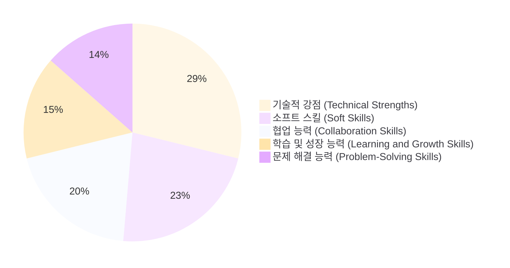

## 안녕하세요, 프론트엔드 개발자 김다은입니다.
- 개발을 통해 몰입을 배우고, 몰입으로 삶의 즐거움을 깨달았습니다. 
- 개발로 얻은 좋은 에너지를 사람들에게 나누는 삶을 살고 싶습니다.

## 💪 My Strength

> 4개월 동안 제 코드를 리뷰해주신 리뷰어와 페어 프로그래밍한 동료들에게 받은 피드백을 바탕으로 작성된 차트 입니다. 구체적인 내용은 [여기]()에서 확인해보실 수 있습니다.

 

### 💻 Tech Stack
       

### 📊 GitHub Stats

---

 

